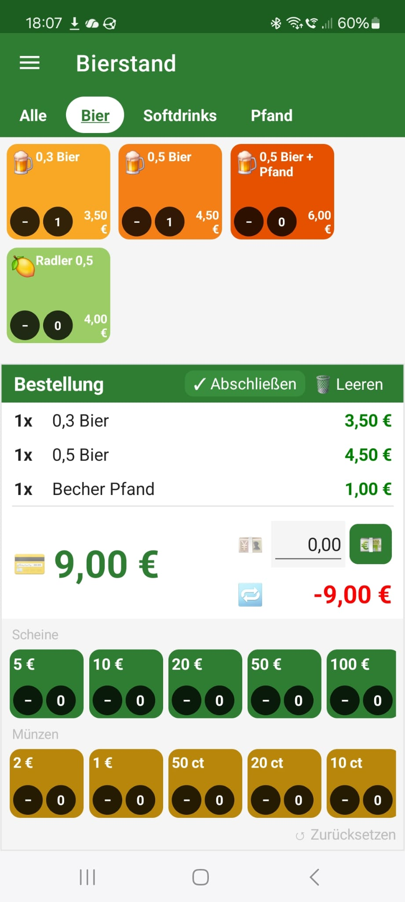
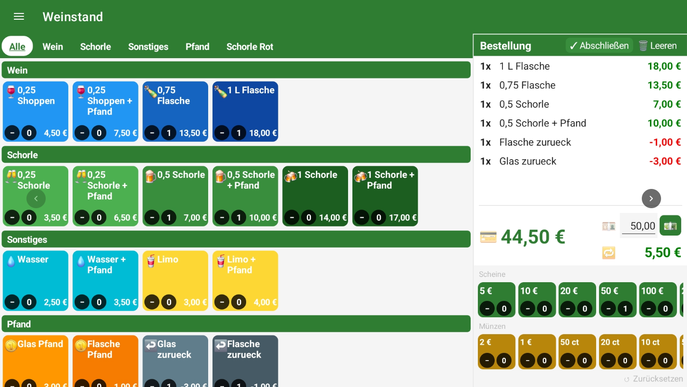

# FestKasse 💰

**[🇩🇪 Deutsch](#deutsch) | [🇬🇧 English](#english)**

A .NET MAUI cash register app for Android — perfect for festivals, markets, and events.  
Eine .NET MAUI Kassen-App für Android — ideal für Feste, Märkte und Veranstaltungen.

[](LICENSE)

---

## Screenshots

| Kasse / POS | Kasse / POS Tablet |
|:-:|:-:|
|  |  |

---

<a name="english"></a>
## 🇬🇧 English

### Overview

FestKasse is a fully offline point-of-sale (POS) app for Android smartphones and tablets, built with .NET MAUI. It's designed for small festival booths, market stalls, and event stands where a simple, fast, and reliable cash register is needed — no internet connection required.

### Features

- 🎪 **Multiple stands** — manage different booths with separate articles
- 🧮 **Fast checkout** — tap article tiles, see totals and change instantly
- 📂 **Categories** — filter articles by category for quick access
- 🎨 **Customizable tiles** — colors, emojis, sizes
- 💵 **Cash panel** — tap bills & coins to calculate received amount
- 📊 **Order history** — view, expand, export, and delete past orders
- 📤 **Export/Import** — JSON data export, database export, HTTP sync
- 🔒 **Fully offline** — no internet needed for daily use
- 📱 **Phone & tablet** — responsive layout

### Quick Start

1. Install the APK on your Android device
2. Create a stand (booth) in Stand Management
3. Add articles with prices, categories, and colors
4. Set the stand as active → start selling!

### Installation

1. Copy the APK file to your Android device
2. Allow **"Install from unknown sources"** in Android settings
3. Tap the APK and confirm installation

### Build from Source

**Requirements:**
- .NET 9 SDK
- Android SDK (API 26+)
- Visual Studio 2022+ with MAUI workload or VS Code with C# Dev Kit

```bash
dotnet restore
dotnet build -c Release -f net9.0-android
```

The signed APK will be in `bin/Release/net9.0-android/`.

---

<a name="deutsch"></a>
## 🇩🇪 Deutsch

### Übersicht

FestKasse ist eine vollständig offline-fähige Kassen-App für Android-Smartphones und -Tablets, entwickelt mit .NET MAUI. Sie ist für kleine Verkaufsstände auf Festen, Märkten und Veranstaltungen konzipiert — kein Internet zum Kassieren nötig.

### Funktionen

- 🎪 **Mehrere Stände** — verschiedene Verkaufsbereiche mit eigenen Artikeln
- 🧮 **Schnelles Kassieren** — Artikel-Kacheln antippen, sofort Summe und Rückgeld sehen
- 📂 **Kategorien** — Artikel nach Kategorie filtern
- 🎨 **Anpassbare Kacheln** — Farben, Emojis, Größen
- 💵 **Geld-Panel** — Scheine & Münzen antippen zum schnellen Zusammenzählen
- 📊 **Bestellverlauf** — vergangene Bestellungen anzeigen, aufklappen, exportieren, löschen
- 📤 **Export/Import** — JSON-Datenexport, Datenbankexport, HTTP-Sync
- 🔒 **Vollständig offline** — kein Internet im Alltag nötig
- 📱 **Handy & Tablet** — responsives Layout

---

### Benutzerhandbuch

#### 1. Erster Start – Stand anlegen

Beim ersten Start ist noch kein Stand eingerichtet. Über das **Flyout-Menü** (Wischen von links oder Hamburger-Icon oben links) gelangt man zur **Standverwaltung**:

1. Im Feld *Standname* einen Namen eingeben (z. B. „Brotzeitstand" oder „Getränke").
2. Auf **➕ Hinzufügen** tippen.
3. Den neu angelegten Stand mit **Aktiv setzen** als aktiven Stand markieren.
   → Die App wechselt automatisch zur Kassenansicht.

> Mehrere Stände können angelegt werden, z. B. für verschiedene Verkaufsbereiche. Es ist immer genau ein Stand gleichzeitig aktiv.

#### 2. Artikel anlegen

Über das Flyout-Menü → **Artikelverwaltung**:

- **➕ Neuen Artikel hinzufügen** öffnet das Formular.
- Folgende Felder ausfüllen:

  | Feld | Beschreibung |
  |---|---|
  | Beschreibung | Name des Artikels, der auf der Kachel erscheint |
  | Kategorie | Kategorie für den Filterbalken (frei wählbar) |
  | Preis (€) | Verkaufspreis; negative Werte für Pfand-Rückgabe möglich |
  | Farbe | Kachelfarbe zur optischen Unterscheidung |
  | Icon | Emoji-Icon, das auf der Kachel angezeigt wird |
  | Stand | Welchem Stand der Artikel zugeordnet ist |

- Reihenfolge der Artikel lässt sich per **Drag & Drop** anpassen.
- Bestehende Artikel können über die Stift-Schaltfläche **bearbeitet** und über den Papierkorb **gelöscht** werden.

#### 3. Kassieren

Im Flyout-Menü → **Kasse** (oder nach „Aktiv setzen" automatisch):

**Artikel auswählen:**
- Die Artikel des aktiven Stands werden als farbige Kacheln angezeigt.
- Mit dem **Kategoriefilter** (Leiste oben) lässt sich die Ansicht auf eine Kategorie einschränken.
- **➕-Button** auf einer Kachel → Artikel in den Warenkorb legen.
- **➖-Button** → Artikel wieder entfernen.
- Die aktuelle Stückzahl wird direkt auf der Kachel angezeigt.

**Warenkorb & Abrechnung (unterer Bereich):**

| Symbol | Bedeutung |
|---|---|
| 💳 | Gesamtbetrag der aktuellen Bestellung |
| 💴 | Eingabefeld für den erhaltenen Geldbetrag |
| 🔁 | Berechnetes Rückgeld (grün = positiv, rot = zu wenig) |
| 💵 | Öffnet das Scheine-&-Münzen-Panel zur schnellen Betrageingabe |

- Im **Scheine- & Münzen-Panel** können Geldscheine (5 €–200 €) und Münzen (0,10 €–2 €) angetippt werden.
- **🗑 Leeren** setzt den Warenkorb zurück.

#### 4. Kategorieverwaltung

Über das Flyout-Menü → **Kategorieverwaltung**:

- Kategorien **hinzufügen** und **löschen**.
- Kategorien steuern den Filterbalken in der Kassenansicht.

#### 5. Standverwaltung

Über das Flyout-Menü → **Standverwaltung**:

- **Neuen Stand anlegen** mit beliebigem Namen.
- **Aktiv setzen** wechselt den aktiven Stand und springt direkt zur Kasse.
- **✏️ Umbenennen** ändert den Namen eines Stands.
- **🗑 Löschen** entfernt einen Stand (mindestens ein Stand muss erhalten bleiben).

#### 6. Einstellungen

Über das Flyout-Menü → **⚙️ Einstellungen**:

| Option | Beschreibung |
|---|---|
| Display-Timeout | Wie lange der Bildschirm beim Kassieren aktiv bleibt (0 = nie ausschalten) |
| Kachelgröße | Größe der Artikel-Kacheln in der Kassenansicht anpassen |
| Logo | Eigenes Logo hochladen (wird im oberen Bereich der Kasse angezeigt) |
| Sync-URL | URL zu einer JSON-Konfigurationsdatei für automatische Synchronisation |
| Daten exportieren | Exportiert alle Artikel und Einstellungen als JSON-Datei |
| Daten importieren | Lädt eine zuvor exportierte JSON-Datei in die App |

#### 7. Import / Export / Sync

**Export:** Einstellungen → **Daten exportieren** → Stand(e) auswählen → **Exportieren**.

**Import:** Einstellungen → **Daten importieren** → JSON-Datei aus dem Dateisystem wählen. Bestehende Daten werden durch den Import **überschrieben**.

**HTTP-Sync:** Eine Konfigurationsdatei kann auf einem Webserver bereitgestellt werden. URL in den Einstellungen eintragen → **Jetzt synchronisieren**. Nützlich um alle Kassen-Geräte einer Veranstaltung zentral zu konfigurieren.

---

### JSON-Format (Referenz)

```json
{
  "ActiveStandId": "uuid-des-aktiven-stands",
  "Stands": [
    {
      "Id": "uuid-des-stands",
      "Name": "Brotzeitstand",
      "Articles": [
        {
          "Id": "uuid",
          "Description": "Cola 0,5l",
          "CategoryId": "uuid-der-kategorie",
          "Category": "Getränke",
          "Color": "#4CAF50",
          "Icon": "🥤",
          "Price": 2.50,
          "SortOrder": 0
        }
      ],
      "Settings": {
        "DisplayTimeoutMinutes": 10,
        "TileSize": 120,
        "TileColumns": 0,
        "LogoBase64": null,
        "SyncUrl": "https://example.com/config.json",
        "Categories": [
          { "Id": "uuid", "Name": "Getränke", "SortOrder": 0 },
          { "Id": "uuid", "Name": "Speisen", "SortOrder": 1 }
        ],
        "AvailableColors": ["#4CAF50", "#2196F3", "#F44336"]
      }
    }
  ]
}
```

---

## Android Permissions

| Permission | Usage |
|---|---|
| `CAMERA` | QR code scanning for data import/sync |
| `INTERNET` | HTTP sync from a URL |
| `ACCESS_NETWORK_STATE` | Check network before sync |
| `WAKE_LOCK` | Keep screen on during checkout |
| `READ_EXTERNAL_STORAGE` | JSON import from file |
| `WRITE_EXTERNAL_STORAGE` | JSON export to file |

---

## Build Instructions

### Prerequisites

- **.NET 9 SDK** — [Download](https://dotnet.microsoft.com/download/dotnet/9.0)
- **Android SDK** (API Level 26+)
- **JDK 17+**
- **Visual Studio 2022** (17.8+) with .NET MAUI workload **OR** **VS Code** with C# Dev Kit

### Setup

1. **Clone the repository:**
   ```bash
   git clone https://github.com/YOUR_USERNAME/FestKasse.git
   cd FestKasse
   ```

2. **Restore dependencies:**
   ```bash
   dotnet restore
   ```

3. **Install MAUI workload** (if not already installed):
   ```bash
   dotnet workload install maui
   ```

### Build & Run

#### Debug Build (Quick Testing)

```bash
# Build debug APK
dotnet build -f net9.0-android

# Run on connected device/emulator
dotnet run -f net9.0-android
```

Or open in **Visual Studio 2022** → Set startup project to `FestKasse (net9.0-android)` → Press F5.

#### Release Build (Production APK)

**Option 1: Build via CLI**

```bash
# Build release APK (unsigned)
dotnet build -c Release -f net9.0-android

# APK location:
# bin/Release/net9.0-android/com.festkasse.app-Signed.apk
```

**Option 2: Build & Sign via Visual Studio**

1. Open `FestKasse.sln` in Visual Studio 2022
2. Right-click the project → **Properties** → **Android** → **Package Signing**
3. **Create a new keystore** or select an existing one:
   - Store path: `FestKasse.keystore`
   - Alias: `festkasse`
   - Password: (secure password)
4. **Build** → **Archive** (for release)
5. **Distribute** → **Ad Hoc** → Sign with your keystore
6. APK will be in `bin/Release/net9.0-android/publish/`

**Option 3: Sign Manually with `jarsigner`**

```bash
# Build unsigned APK
dotnet build -c Release -f net9.0-android

# Sign with your keystore
jarsigner -verbose -sigalg SHA256withRSA -digestalg SHA-256 \
  -keystore FestKasse.keystore \
  bin/Release/net9.0-android/com.festkasse.app.apk \
  festkasse

# Verify signature
jarsigner -verify -verbose -certs bin/Release/net9.0-android/com.festkasse.app.apk

# Align APK (optional but recommended)
zipalign -v 4 bin/Release/net9.0-android/com.festkasse.app.apk \
  bin/Release/net9.0-android/com.festkasse.app-aligned.apk
```

#### Creating a Keystore (First Time Only)

```bash
keytool -genkeypair -v \
  -keystore FestKasse.keystore \
  -alias festkasse \
  -keyalg RSA \
  -keysize 2048 \
  -validity 10000 \
  -storepass YOUR_PASSWORD \
  -keypass YOUR_PASSWORD \
  -dname "CN=FestKasse, OU=Dev, O=YourName, L=City, S=State, C=DE"
```

⚠️ **Keep your keystore file and password safe!** Without it, you cannot update the app on users' devices.

### Deploy to Device

#### Via ADB (Android Debug Bridge)

```bash
# Install on connected device
adb install bin/Release/net9.0-android/com.festkasse.app-Signed.apk

# Or force reinstall (keeps data)
adb install -r bin/Release/net9.0-android/com.festkasse.app-Signed.apk
```

#### Via File Transfer

1. Copy the APK to your device (USB, email, cloud storage)
2. Open the APK file on the device
3. Allow **"Install from unknown sources"** if prompted
4. Tap **Install**

### Troubleshooting

**Build fails with "MAUI workload not found":**
```bash
dotnet workload install maui
dotnet workload restore
```

**"Android SDK not found":**
- Set `ANDROID_HOME` environment variable to your Android SDK path
- Example (Windows): `C:\Program Files\Android\android-sdk`

**"Java version mismatch":**
- Ensure JDK 17+ is installed and `JAVA_HOME` is set correctly

**APK won't install on device:**
- Enable **Developer Options** → **USB Debugging**
- Allow installation from unknown sources (device settings)
- Check that the device API level is 26+ (Android 8.0+)

---

## Tech Stack

- **.NET 9** / **C# 13**
- **.NET MAUI** (Android)
- **Entity Framework Core** + SQLite
- **CommunityToolkit.Mvvm** (MVVM source generators)
- **ZXing.Net.Maui** (QR code scanning)

---

## Contributing

Contributions are welcome! Please open an issue or pull request.

1. Fork the repository
2. Create a feature branch (`git checkout -b feature/amazing-feature`)
3. Commit your changes (`git commit -m 'Add amazing feature'`)
4. Push to the branch (`git push origin feature/amazing-feature`)
5. Open a Pull Request

---

## License

This project is licensed under the **GNU General Public License v3.0** — see the [LICENSE](LICENSE) file for details.

You are free to use, modify, and distribute this software under the terms of the GPL-3.0. Any derivative work must also be distributed under the same license.
